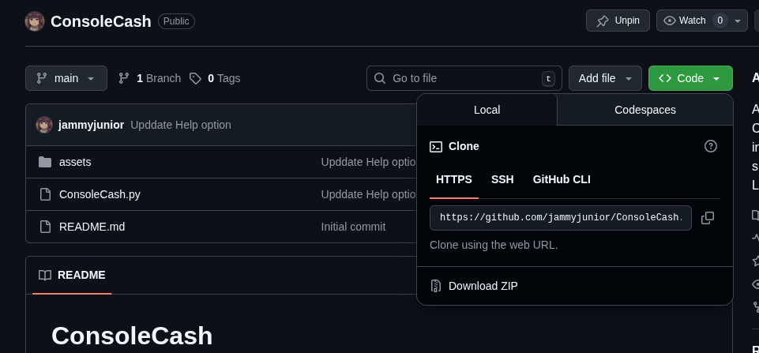

# ConsoleCash
A cash register without a traditional UI. ConsoleCash brings you a console interface that feels just like Linux. It looks simple, but it’s powerful — just like the Linux terminal.

- [ConsoleCash](#consolecash)
- [Before you begin](#before-you-begin)
  - [Requirement](#requirement)
  - [Download ConsoleCash](#download-consolecash)
  - [Run ConsoleCash](#run-consolecash)
- [User Guide](#user-guide)
  - [Add Command](#add-command)
  - [Calculate Command](#calculate-command)
  - [Clear Command](#clear-command)
  - [Exit Command](#exit-command)
  - [Help Command](#help-command)
  - [List Command](#list-command)
  - [Remove Command](#remove-command)
  - [Update Command](#update-command)
  - [Save Command:](#save-command)
- [Advanced ConsoleCash](#advanced-consolecash)
  - [Add Command](#add-command-1)
  - [Update Command](#update-command-1)
  - [Remove Command](#remove-command-1)
  - [Save Command](#save-command-1)
  - [Working with session](#working-with-session)
    - [Create a new session](#create-a-new-session)
    - [Switch sessions](#switch-sessions)
    - [Save your work](#save-your-work)
    - [Current session](#current-session)
    - [See all available sessions](#see-all-available-sessions)
    - [Delete a session](#delete-a-session)
- [Contributing](#contributing)

# Before you begin

## Requirement
Python 3 must be installed. Download Python from [python.org](https://python.org).

## Download ConsoleCash
If you've installed Git, we highly recommend clone the repository.
```
git clone https://github.com/jammyjunior/ConsoleCash.git
```
Or you can also go to `code`, click `Download ZIP` to download the project. Then unzip the file.



## Run ConsoleCash
On Windows, open Command Prompt.    <br/>
On Linux or macOS, open Terminal.

Then type:
```
python3 /path/to/your/file/ConsoleCash/ConsoleCash.py
```
If you see this one, congrats, now you can start using ConsoleCash.
```
    #############################
    #                           #
    #        ConsoleCash        #
    #                           #
    #############################

Welcome to ConsoleCash! For a new user, type 'help' for help, 'exit' to exit.
console@consolecash:~$ 
```

# User Guide
## Add Command
To add a new item, type `a` or `add` to the console. Then, you enter the values ​​one by one. For example:
```
console@consolecash:~$ add
Item name: Iphone 17
Price: 999
Quantity: 2
```

## Calculate Command
To calculate the total of all the items, type `c` or `calculate`.
```
console@consolecash:~$ calculate
Items in register:

Name                                Price      Quantity   Amount    
-----------------------------------------------------------------
Iphone 17                           999.00     2          1998.0    
Macbook Pro                         1999.00    1          1999.0    

Total: 3997.00 $
```

## Clear Command
To clear the console, type `clear`.     <br/>
*Note: Clear command doesn't wiped out your data. It just makes your console looks much cleaner.


## Exit Command
To exit the console, type `e` or `exit`.    <br/>
⚠️ Remember: save your work before closing ConsoleCash. <br/>
*Note: All your data you've added will be removed.

## Help Command
To display all available commands, type `h` or `help`.


## List Command
To list all existing items, type `l` or `list`.
```
console@consolecash:~$ list
Items in register:

Name                                Price      Quantity  
-------------------------------------------------------
Iphone 17                           999.00     2         
Macbook Pro                         1999.00    1   
```

## Remove Command
To remove an item, type `r` or `remove`. Then type the item name that you want to remove. For example:
```
console@consolecash:~$ remove 
Item name to remove: Iphone 17
```

To remove all existing items, type `r -a` or `remove -all`. <br/>
*Note: All your data you've add will be removed.

## Update Command
To update an existing item, type `u` or `update`. Then, you enter the new values ​​one by one. For example:
```
console@consolecash:~$ update 
Item name to update: Iphone 17
Price: 899
Quantity: 2
```
## Save Command:
To save your bill, type `save` and the file name you want to create. For example:
```
console@consolecash:~$ save
File name: mybill
Items in register:

Name                                Price      Quantity   Amount    
-----------------------------------------------------------------
Iphone 16                           999.00     2          1998.0    
Macbook Pro                         1999.00    1          1999.0    

Total: 3997.00 $

[OK] File mybill.txt was saved successfully!
Path to your file: /path/to/your/file/mybill.txt
```
With `mybill` is the file name, ConsoleCash will save the bill to mybill.txt and tell you the path to the file.

# Advanced ConsoleCash
As I promise, ConsoleCash is very powerful. Let's take a look for some advanced command.

## Add Command
You can type every values of the item to the console to add it. For example:
```
add Macbook Pro 1999 1
```
With 'Macbook Pro' is the item name, 1999 is the price and 1 is the quantity.

## Update Command
You can type every values of the item to the console to update. For example:
```
update Macbook Pro 1899 2
```
With 'Macbook Pro' is the item name, 1899 is the update price and 2 is the update quantity.

## Remove Command
To remove a item, you just type `remove` with the item name. For example:
```
remove Macbook Pro
```

## Save Command
Want to save your bill? Just type save followed by the file name you want to create. For example:
```
save mybill
```
Here, mybill is the file name. ConsoleCash will save the bill as mybill.txt and show you the path to the file.

If you want to save your work (not just the bill), move on to the next section.

## Working with session
Welcome to the session feature in ConsoleCash.<br/>
With sessions, you can save your work, switch between multiple sessions, and improve your workflow.<br/>
Let see how can you work with session.

### Create a new session
To start a new session, type `session create` and give a new session name.
```
console@consolecash:~$ session create
Session name: session1
```
You can also type `session create session1`.

### Switch sessions
ConsoleCash supports multiple sessions, so you can switch between them.<br>
To switch to a session, type `session checkout` and provide the session name:
```
console@consolecash:~$ session checkout  
Session name: session1
[OK] Switched to: session1
```
You can also type `session checkout session1`.<br/>
⚠️ Remember: save your work before switching to another session or closing ConsoleCash.

### Save your work
To save your current session, type: `session save` or `session commit` <br/>
To save your work into a different session, type session save followed by a new or existing session name:
```
console@consolecash:~$ session save session2
```
If the session already exists, it will be overwritten.

### Current session
To see which session are you working on, type:
```
console@consolecash:~$ session current
Current session: session1
```

### See all available sessions
To list all sessions, type:
```
console@consolecash:~$ session list
Sessions list:
> session1
  session2
  session3
```
The mark `>` also tell you which session are you working in.

### Delete a session
To delete a session, type `session delete` and provide the session name:
```
console@consolecash:~$ session delete
Session name: session3
[OK] session3 has been deleted.
```
You can also type `session delete session3`.

# Contributing
Pull requests are welcome!

This project isn't perfect, and I'm always looking for ways to improve it. If you're interested in helping, feel free to submit a pull request.

I want to make ConsoleCash more complicated. If you have any ideas, share it with me.

Thanks for your help! ❤️

